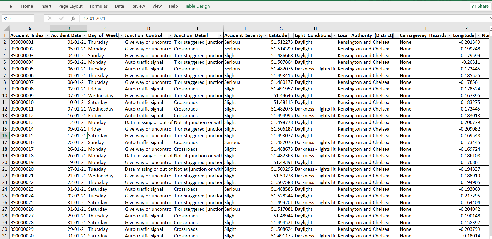

# Power-BI-Project_Road-Accident-Dashboard
The purpose of this project is to monitor, analyze, and visualize road accident data to help authorities, policymakers, and the public make informed decisions regarding road safety measures.

 
 
## Business Problem
- Primary KPI - Total casualities and total accident values for current tear and year-over-year growth.
- Primary KPI's - Total casualities by accident severity for current year and YoY growth.
- Secondary KPI's - Total casualities with respect to vehicle type for current year.
- Monthly trend showing comparison of casualities for current year and previous yesr.
- Casualities by road type for current year.
- Current year casualities by area/location and by day/night.
- Total casualities and total accidents by location.

## Stakeholders
- Ministry of Transport
- Road Transport Department
- Police force
- Emergency Services Department 
- Road Safety Corps
- Transport Operators
- Traffic Management Agencies
- Public
- Media

For this project, there is a few simple steps that I always follow:
## Connect to Data
 

- Start by connecting Power BI to your data source. Power BI supports a wide range of data sources, including databases, Excel files, SharePoint lists, online services, and more. Use the "Get Data" option in the Home tab to establish a connection.

## Import or Direct Query
- Power BI offers two options for data retrieval: Import and Direct Query. Importing data loads it into Power BI's internal data model, while Direct Query allows you to query data directly from the source without importing it. Choose the appropriate option based on your data size and real-time requirements.

## Transform and Clean Data
- Once the data is loaded, use Power Query Editor to transform and clean the data as needed. This includes tasks such as removing duplicates, filtering, splitting columns, merging tables, applying calculations, and more. The Power Query Editor provides a user-friendly interface for these operations.

## Create Relationships
- Establish relationships between tables if your data includes multiple tables. Power BI's automatic relationship detection can recognize common fields, but you can also manually define relationships using the "Manage Relationships" option in the Home tab.

 
 
## Choose Visualizations
- Power BI offers a wide range of visualizations, including charts, tables, maps, gauges, cards, and more. Select the appropriate visualizations based on the type of data and the insights you want to convey. You can find the visualization options in the "Visualizations" pane on the right side of the screen.

 
 
 
## Drag and Drop Fields
- To create visualizations, drag and drop the fields from your data onto the canvas. Power BI automatically suggests suitable visualizations based on the selected fields, or you can manually choose the visualization type. You can also add multiple visualizations to the same report page.

## Configure Visualizations
- Customize the visualizations by adjusting their properties. You can modify axes, colors, labels, legends, titles, and other formatting options. The "Format" pane on the right side provides a range of customization settings for each visualization.

## Add Interactivity
- Enhance your visualizations by adding interactive features. Power BI allows you to create filters, slicers, drill-through actions, bookmarks, and other interactions to enable users to explore the data and gain insights dynamically.

## Create Calculations
- Use DAX (Data Analysis Expressions) to create calculated columns, measures, and aggregations. DAX is a formula language specific to Power BI that enables complex calculations and data analysis. You can write DAX expressions in the "Fields" pane or use the "New Measure" option in the Modeling tab.

## Publish and Share
- Once you have created your visualizations and reports, you can publish them to the Power BI service for sharing with others. Use the "Publish" option in the Home tab to upload your report to the Power BI cloud. From there, you can share the report with specific individuals or groups, embed it in websites or SharePoint, or export it in various formats.

 
 
 
